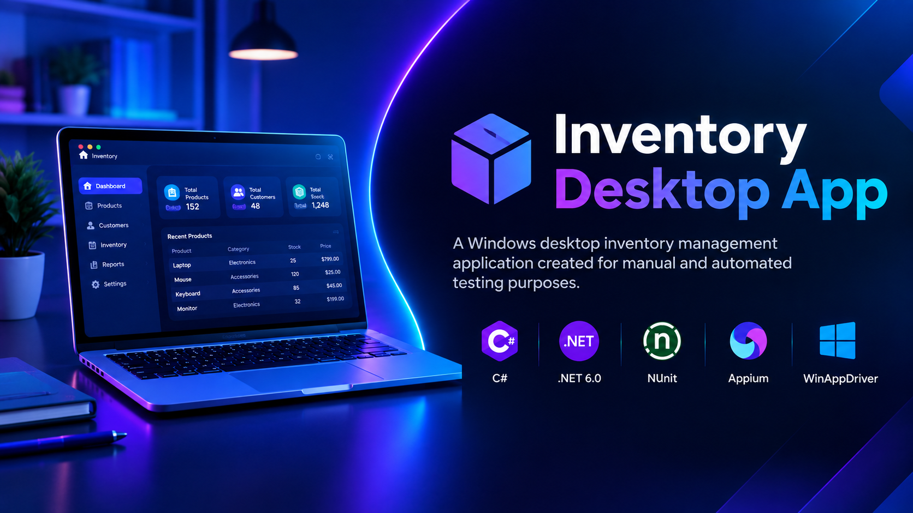

# Inventory Desktop App

# Inventory Desktop App

  

## Purpose / Scope

Windows desktop inventory management application created for
manual and automated testing purposes.
Supports both manual testing and desktop UI automation using
**Appium and WinAppDriver**.

## Features

- User authentication
- Product management
- Customer management
- Inventory management
- Input validation
- SQLite database

## Download

A ready-to-run Windows version is available in
[GitHub Releases](../../releases/latest).
